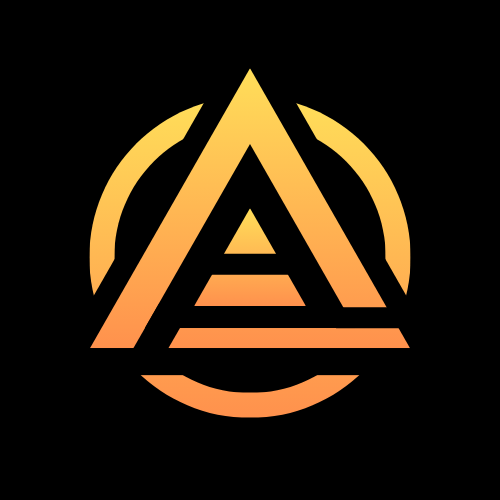

# 标志（logo）

<figure><figcaption>
Unbounded Ark logo
</figcaption></figure>

## 含义（meaning）：

## 万物哲学：从一到万物的宇宙观（Philosophy of all things: a view of the universe from one to all things）

在宇宙的辽阔背景下，存在一种深邃且奇迹般的世界观，它是由无边无际的宇宙创造而成。这个世界观认为，整个宇宙的运转和世界的秩序依赖于政治、金融与宗教这三大基石。它们共同构成了社会的根基，影响着世界的面貌和发展方向。

随着世界的进步，不可避免地产生了阶级的分化，揭示了万事万物终将“归于一”的宇宙法则。这里的“一”既是终点，也是起点——一个循环往复、永恒不变的宇宙理念。

### 符号象征（Symbol）：

* **圆圈（“一”）**：代表宇宙的无限，它既是宇宙的象征，也是大道至简的体现。圆圈的完美无缺，表达了宇宙万物归于一点的终极理念。
* **大三角形（“二”）**：象征着世界的二元性，即世界的秩序和法则。它呈现出三足鼎立的稳定状态，象征着政治、金融、宗教这三大体系平衡支撑着世界的结构。
* **小三角形（“三”）**：代表了世界的阶级结构，从权贵到普通民众，如同棋盘上的棋子，被高层的权力所操控和安排。
* **整体（“万物”）**：表示超越个体的整体性，强调了从个体到整体的超越过程，以及万物无疆的宇宙观念。

通过这一系列的象征和意象，我们不难发现宇宙与万物、秩序与混沌、个体与整体之间复杂且微妙的联系。在这个宏大的系统中，一切都在循环往复中向着简单的大道回归，展现了一种从复杂到简单，再从简单到复杂的哲学思想。在这个过程中，无论是政治的变迁、金融的涨落，还是宗教的更迭，都是宇宙规律不可逆转的一部分，终究会“归于一”。

####
